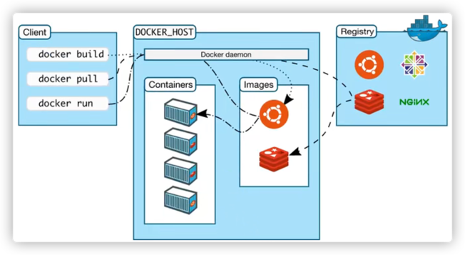

# Docker是什么?

Docker 是一个开源的应用容器引擎，让开发者可以打包他们的应用以及依赖包到一个可移植的镜像中，然后发布到任何流行的 Linux或Windows操作系统的机器上，也可以实现虚拟化。容器是完全使用沙箱机制，相互之间不会有任何接口。

> ex:
> 前端Vue需要build打包在nginx环境部署；
> 后端Java需要`java -jar app.jar`运行；
> 前后端需要安装不同的环境去部署运行。
> 这个时候我们可以通过docker容器统一的环境去一键运行发布这些应用`docker run ...`。

Docker 包括三个基本概念:

1. 镜像（Image）：一个特殊文件系统。ex: ubuntu系统。
2. 容器（Container）：容器是镜像运行时的实体。容器可以被创建、启动、停止、删除等。
3. 仓库（Repository）：保存镜像。  ex: [https://hub.docker.com](https://hub.docker.com)
    - public（共有仓库）：免费上传、下载公开的镜像。
    - private（私有仓库）：需要认证才能上传、下载镜像。

Docker 使用客户端-服务器 (C/S) 架构模式，使用远程API来管理和创建Docker容器。

### 架构

