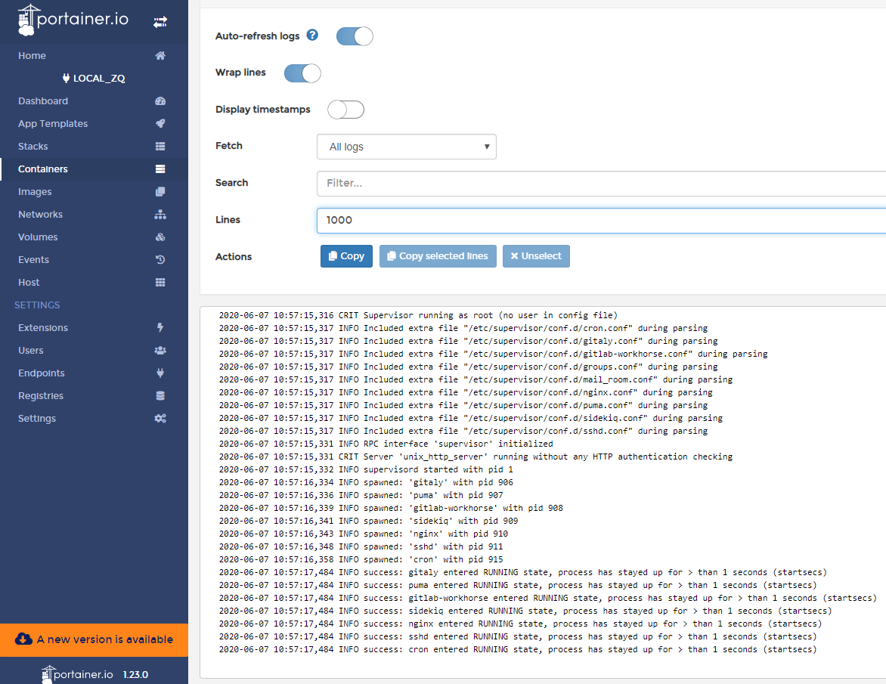

# docker-compose-windows


## 环境准备

Docker安装教程：[https://zhengqing.blog.csdn.net/article/details/103441358](https://zhengqing.blog.csdn.net/article/details/103441358)

> 注：建议使用`Git Bash Here`执行以下命令

```shell script
# 创建文件夹
mkdir -p E:/IT_zhengqing/soft/soft-dev/Docker
cd E:/IT_zhengqing/soft/soft-dev/Docker

git clone https://gitee.com/zhengqingya/docker-compose.git
cd docker-compose/Windows
```

## 运行服务

### 安装Docker可视化界面工具`Portainer`

> 挂载宿主机目录的时候可能会出现如下问题，点击`Share it`即可
> 

```shell
docker-compose -f docker-compose-portainer.yml -p portainer up -d
```

然后访问 [http://127.0.0.1:9000/](http://127.0.0.1:9000/) 创建用户账号密码


打开docker设置


然后回到浏览器填写如下信息即可~
> local_zq ->  docker.for.win.localhost:2375


如果连接出现问题，可尝试设置2375端口转发

```
# 将127.0.0.1的2375端口转发到192.16.0.88的2375上
netsh interface portproxy add v4tov4 listenport=2375 connectaddress=127.0.0.1 connectport=2375 listenaddress=ip protocol=tcp
# ex: netsh interface portproxy add v4tov4 listenport=2375 connectaddress=127.0.0.1 connectport=2375 listenaddress=192.16.0.88 protocol=tcp

# 再次连接
# Name: local_zq
# Endpoint URL: 192.16.0.88:2375
```

### MySQL

```shell
# 5.7
docker-compose -f docker-compose-mysql5.7.yml -p mysql5.7 up -d
# 8.0
docker-compose -f docker-compose-mysql8.0.yml -p mysql8.0 up -d
```

### Yearning

```shell
docker-compose -f docker-compose-yearning.yml -p yearning up -d
```

访问地址：[`http://127.0.0.1:8000/`](http://127.0.0.1:8000/)
默认登录账号密码：`admin/Yearning_admin`

### Couchbase

```shell
docker-compose -f docker-compose-couchbase.yml -p couchbase up -d
```

管理平台地址：[`http://127.0.0.1:8091`](http://127.0.0.1:8091)
默认登录账号密码：`Administrator/password`

### Redis

```shell
docker-compose -f docker-compose-redis.yml -p redis up -d
```

连接redis

```shell
docker exec -it redis redis-cli -a 123456  # 密码为123456
```

### Jrebel

```shell
docker-compose -f docker-compose-jrebel.yml -p jrebel up -d
```

默认反代`idea.lanyus.com`, 运行起来后

1. 激活地址： `http://127.0.0.1:8888/UUID` -> 注：UUID可以自己生成，并且必须是UUID才能通过验证 -> [UUID在线生成](http://www.uuid.online/)
2. 邮箱随意填写


### Nginx

```shell
docker-compose -f docker-compose-nginx.yml -p nginx up -d
```

访问地址：[`http://127.0.0.1/`](http://127.0.0.1/)

### Elasticsearch

```shell
docker-compose -f docker-compose-elasticsearch.yml -p elasticsearch up -d
```

### RabbitMQ

```shell
docker-compose -f docker-compose-rabbitmq.yml -p rabbitmq up -d
```

web管理端：[`http://127.0.0.1:15672`](http://127.0.0.1:15672)
登录账号密码：`admin/admin`

### ActiveMQ

```shell
docker-compose -f docker-compose-activemq.yml -p activemq up -d
```

访问地址：[`http://127.0.0.1:8161`](http://127.0.0.1:8161)
登录账号密码：`admin/admin`

### BaiduPCS-Web

```shell
docker-compose -f docker-compose-baidupcs-web.yml -p baidupcs-web up -d
```

访问地址：[`http://127.0.0.1:5299`](http://127.0.0.1:5299)

### MinIO

```shell
docker-compose -f docker-compose-minio.yml -p minio up -d
```

访问地址：[`http://127.0.0.1:9001/minio`](http://127.0.0.1:9001/minio)
登录账号密码：`root/password`

### Nacos

```shell
docker-compose -f docker-compose-nacos.yml -p nacos up -d

# mysql数据库版 【 需自己建库`nacos_config`, 并执行`/Windows/nacos_mysql/nacos-mysql.sql`脚本 】
docker-compose -f docker-compose-nacos-mysql.yml -p nacos up -d
```

访问地址：[`http://127.0.0.1:8848/nacos`](http://127.0.0.1:8848/nacos)
登录账号密码默认：`nacos/nacos`

> 注：`docker-compose-nacos-mysql.yml`已开启连接密码安全认证，在java连接时需新增配置如下

```yml
spring:
  cloud:
    nacos:
      discovery:
        username: nacos
        password: nacos
      config:
        username: ${spring.cloud.nacos.discovery.username}
        password: ${spring.cloud.nacos.discovery.password}
```

### Sentinel

```shell
docker-compose -f docker-compose-sentinel.yml -p sentinel up -d
```

访问地址：[`http://127.0.0.1:8858`](http://127.0.0.1:8858)
登录账号密码：`sentinel/sentinel`

### Kafka

```shell
docker-compose -f docker-compose-kafka.yml -p kafka up -d
```

集群管理地址：[`http://127.0.0.1:9001`](http://127.0.0.1:9001)

### Tomcat

```shell
docker-compose -f docker-compose-tomcat.yml -p tomcat up -d
```

访问地址：[`http://127.0.0.1:8081`](http://127.0.0.1:8081)

### GitLab

```shell
docker-compose -f docker-compose-gitlab.yml -p gitlab up -d
```


gitlab容器启动完成日志如图：


访问地址：[`http://127.0.0.1:10080/`](http://127.0.0.1:10080/)
设置root账号密码


登录成功如下：


### Jenkins

```shell
docker-compose -f docker-compose-jenkins.yml -p jenkins up -d
```

访问地址：[`http://127.0.0.1:8080`](http://127.0.0.1:8080)

### Nextcloud - 多端同步网盘

```shell
docker-compose -f docker-compose-nextcloud.yml -p nextcloud up -d
```

访问地址：[`http://127.0.0.1:81`](http://127.0.0.1:81) , 创建管理员账号

### Walle - 支持多用户多语言部署平台

```shell
docker-compose -f docker-compose-walle.yml -p walle up -d && docker-compose -f docker-compose-walle.yml logs -f
```

访问地址：[`http://127.0.0.1:80`](http://127.0.0.1:80)
初始登录账号如下：

```
超管：super@walle-web.io \ Walle123
所有者：owner@walle-web.io \ Walle123
负责人：master@walle-web.io \ Walle123
开发者：developer@walle-web.io \ Walle123
访客：reporter@walle-web.io \ Walle123
```

### Grafana - 开源数据可视化工具(数据监控、数据统计、警报)

```shell
docker-compose -f docker-compose-grafana.yml -p grafana up -d
```

访问地址：[`http://127.0.0.1:3000`](http://127.0.0.1:3000)
默认登录账号密码：`admin/admin`

### Grafana Loki - 一个水平可扩展，高可用性，多租户的日志聚合系统

```shell
docker-compose -f docker-compose-grafana-promtail-loki.yml -p grafana_promtail_loki up -d
```

访问地址：[`http://127.0.0.1:3000`](http://127.0.0.1:3000)
默认登录账号密码：`admin/admin`

### Graylog - 日志管理工具

```shell
docker-compose -f docker-compose-graylog.yml -p graylog_demo up -d
```

访问地址：[`http://127.0.0.1:9001`](http://127.0.0.1:9001)
默认登录账号密码：`admin/admin`

### FastDFS - 分布式文件系统

```shell
docker-compose -f docker-compose-fastdfs.yml -p fastdfs up -d
```

###### 测试

```shell
# 等待出现如下日志信息：
# [2020-07-24 05:57:40] INFO - file: tracker_client_thread.c, line: 310, successfully connect to tracker server 192.168.0.88:22122, as a tracker client, my ip is 172.31.0.3

# 进入storage容器
docker exec -it fastdfs_storage /bin/bash
# 进入`/var/fdfs`目录
cd /var/fdfs
# 执行如下命令,会返回在storage存储文件的路径信息,然后拼接上ip地址即可测试访问
/usr/bin/fdfs_upload_file /etc/fdfs/client.conf test.jpg
# ex:
http://127.0.0.1:8888/group1/M00/00/00/rBEAAl8aYsuABe4wAAhfG6Hv0Jw357.jpg
```

### YApi - 高效、易用、功能强大的api管理平台

```shell
docker-compose -f docker-compose-yapi.yml -p yapi up -d
```

如下运行成功：

```shell
 log: mongodb load success...
 初始化管理员账号成功,账号名："admin@admin.com"，密码："ymfe.org"
部署成功，请切换到部署目录，输入： "node vendors/server/app.js" 指令启动服务器, 然后在浏览器打开 http://127.0.0.1:3000 访问
log: -------------------------------------swaggerSyncUtils constructor-----------------------------------------------
log: 服务已启动，请打开下面链接访问: 
http://127.0.0.1:3000/
log: mongodb load success...
```

访问地址：[`http://127.0.0.1:3000`](http://127.0.0.1:3000)
默认登录账号密码：`admin@admin.com/ymfe.org`

### RocketMQ

> 注：修改 `xx/rocketmq/rocketmq_broker/conf/broker.conf`中配置`brokerIP1`为`宿主机IP`

```shell
docker-compose -f docker-compose-rocketmq.yml -p rocketmq up -d
```

访问地址：[`http://ip地址:9002`](http://127.0.0.1:9002)

### XXL-JOB - 分布式任务调度平台

```shell
docker-compose -f docker-compose-xxl-job.yml -p xxl-job up -d
```

访问地址：[`http://ip地址:9003/xxl-job-admin`](http://127.0.0.1:9003/xxl-job-admin)
默认登录账号密码：`admin/123456`

### MongoDB - 基于文档的通用分布式数据库

```shell
docker-compose -f docker-compose-mongodb.yml -p mongodb up -d
```

访问地址：[`http://ip地址:1234`](http://127.0.0.1:1234)
Connection string：`mongodb://admin:123456@ip地址:27017`
